<div align="center">

# agent-controls

### Discipline for coding agents, armed rather than promised.

**Deterministic gates on what an agent does · a journal that proves they ran · a
governor that decides which rules earn their place**

[](https://github.com/EmergentSpirit/agent-controls/actions/workflows/ci.yml)
[](LICENSE)
[](tests/)
[](#why-there-is-no-install-step)

[Quickstart](docs/quickstart.md) · [Architecture](ARCHITECTURE.md) ·
[The gates](docs/gates/) · [Contributing](CONTRIBUTING.md)

</div>

---

## The problem

Every team working with a coding agent writes the same document. Always verify
before claiming. Never delete without a backup. Do not rewrite the config on
your own initiative.

It goes in the system prompt, and for a while it works. Then the context gets
long, the task gets interesting, and the rule quietly stops applying. Nothing
errors. Nothing looks wrong. **The agent reports success, and the success is not
real.**

A rule in a prompt is a request. This repository turns the rules that matter
into mechanisms: processes that run outside the model, on files, in plain
Python, with an exit code no turn of phrase can argue with.

<p align="center">
  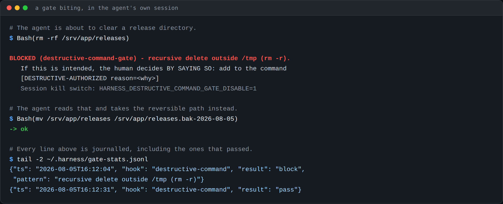
</p>

Notice the shape of the refusal. It says what was blocked, why, **the working
alternative**, and the documented way out. A gate that only says no teaches an
agent to route around gates, and it takes exactly one of those to poison the
credibility of all the others.

---

## What is in here

Nine modules. Take one, take all of them; a single gate dropped into your own
hooks directory is a legitimate way to use this.

| Module | What it does |
|:--|:--|
| **`hooks/`** | **13 gates** on what the agent runs and writes, plus the shared helper. Each one exists because something went wrong once. |
| **`shield/`** | Behavioral rules in **three layers**: injected at the moment of risk, standing format invariants, and a reviewer that judges the outgoing message before it is displayed. |
| **`memory/`** | **Statutory memory**: a verdict on top, a closed status vocabulary, and an index that carries the state of what it points at. |
| **`recall/`** | A catalog that answers **"we already built this"** before an agent rebuilds it, with an executable liveness check per entry. |
| **`sentinel/`** | Daily health checks that **discover** what they audit by reading your wiring. Its central check finds gates that are wired but silent. |
| **`governor/`** | New rules face **two adversarial judges**, then a seven-day observation trial, before anything gets armed. |
| **`watch/`** | A read-only local panel over gates and sessions, with a post-hoc analyst that proposes and never acts. |
| **`mission-control/`** | A read-only local panel over the **present**: which roles are alive, what is scheduled, and what is waiting on a human. |
| **`launchers/`** | Wiring templates: example settings per role, a vault pattern, and systemd units that carry the PATH trap's fix. |

### The thirteen gates, and the day each one was earned

- a shell command prefixed with `HOME=` returned a **silently false result**
  that got reported as fact
- a regex with unbounded quantifiers **OOM-killed two panes**, on two separate
  days
- renaming a live hook instead of copying it **froze a production session**:
  config is read at boot, and a vanished hook blocks every prompt after
- an LLM judge that could see the answer it was grading returned a **flawless
  verdict** on work that was wrong, and cost real money to produce
- an index line said a name had been relaunched; the real decision, buried in a
  note body, was that the name was taken. **The index won**, and work restarted
  down a dead path

Every gate ships with its founding incident, anonymized but real, in
[`docs/gates/`](docs/gates/).

---

## The load-bearing idea

> **A gate that stays silent cannot be told apart from a gate that is dead.**

So every hook writes one line to a journal on every execution, whatever the
outcome, including the boring ones. A gate that blocks nothing today still
proves it ran. The sentinel cross-checks that journal daily and flags anything
wired but silent, because a dead gate does not scream: it goes quiet, and quiet
reads exactly like a good day.

Everything else follows from that:

**Fail-open, everywhere.** A crashing gate lets the work through and says so. A
harness that can halt the work becomes the thing you disable under pressure, and
a disabled harness protects nothing.

**A kill-switch is allowed, and never silent.** Route around a gate and the
journal records `skip-disabled`. Bypasses are legitimate; invisible ones are not.

**Nothing arms itself.** Cloning this repository changes nothing. Gates run
because a settings file names them, and that file is yours.

---

## Watch: seeing what actually happened

A read-only panel, bound to loopback, over the journal and the session
transcripts. It observes; it never intervenes.

<p align="center">
  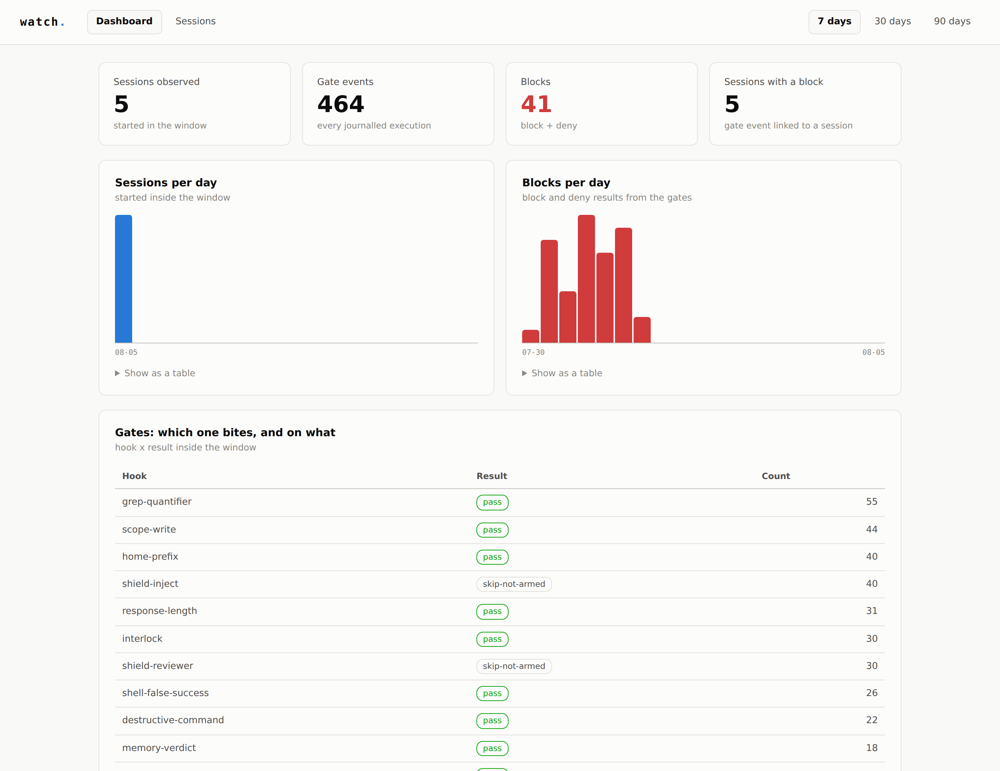
</p>

<p align="center"><em>Which gate bites, on what, and how often. Every result in
the frozen vocabulary is counted, so a gate sitting at zero is visible.</em></p>

<table>
<tr>
<td width="50%">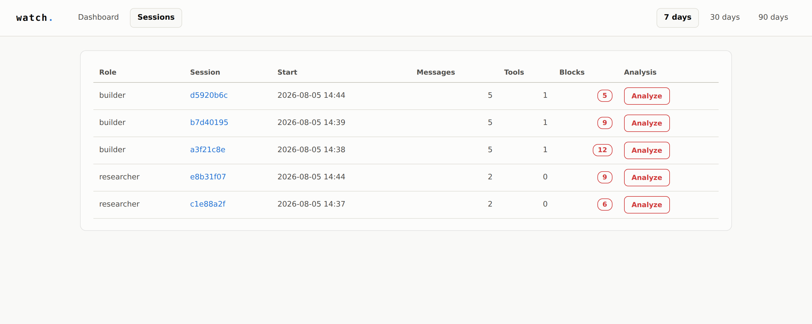</td>
<td width="50%">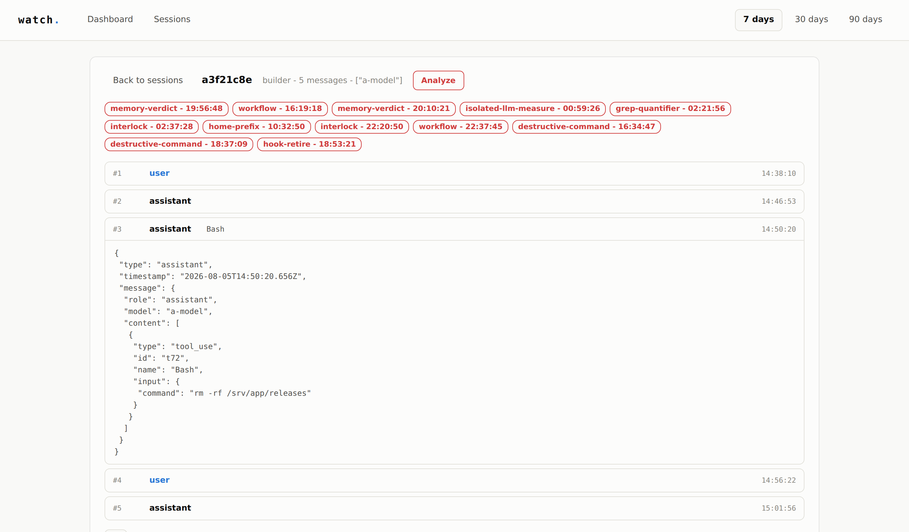</td>
</tr>
<tr>
<td><strong>Sessions.</strong> One row per session, per role, with the number of
blocks it collected.</td>
<td><strong>Trajectory.</strong> The gates that fired, then the turn-by-turn
thread. Expand a message to see the exact tool call.</td>
</tr>
</table>

The panel has a **deliberate blind spot**: excluded transcripts are never
indexed, retroactively. An observation panel that can see everything ends up
watching people rather than gates.

---

## Mission control: what is happening right now

`watch` reads the past. This one reads the **present**, and those are different
questions. A log line proves an agent was alive when it wrote the line. It never
proves the agent is alive now, that a timer is about to fire, or that something
has been sitting there since lunch waiting for a human to say yes.

Run more than one agent and the failure mode stops being "an agent did something
wrong". It becomes **nobody noticed**.

<p align="center">
  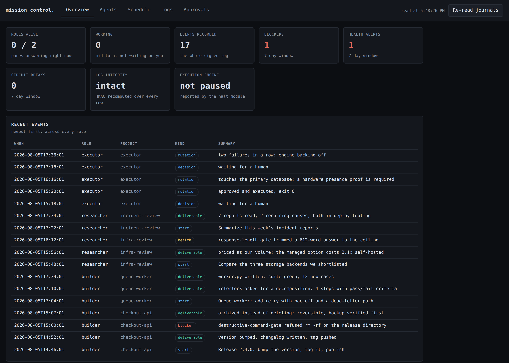
</p>

<p align="center"><em>Counts are windowed, seven days by default: an all-time
counter keeps one bad afternoon on screen forever, and a number that never moves
stops being read.</em></p>

<table>
<tr>
<td width="50%">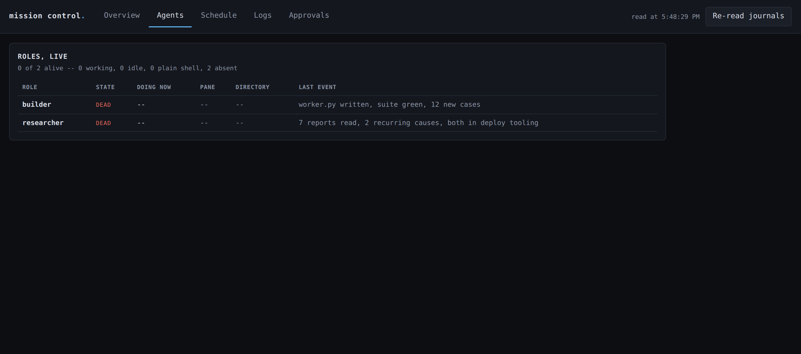</td>
<td width="50%">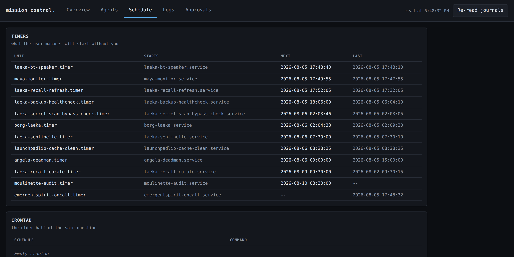</td>
</tr>
<tr>
<td><strong>Agents.</strong> Two sources on purpose: the multiplexer answers
"alive", the log answers "what happened". Neither can answer both.</td>
<td><strong>Schedule.</strong> What is armed and when it fires next. A timer
nobody remembers arming is the classic surprise.</td>
</tr>
</table>

<p align="center">
  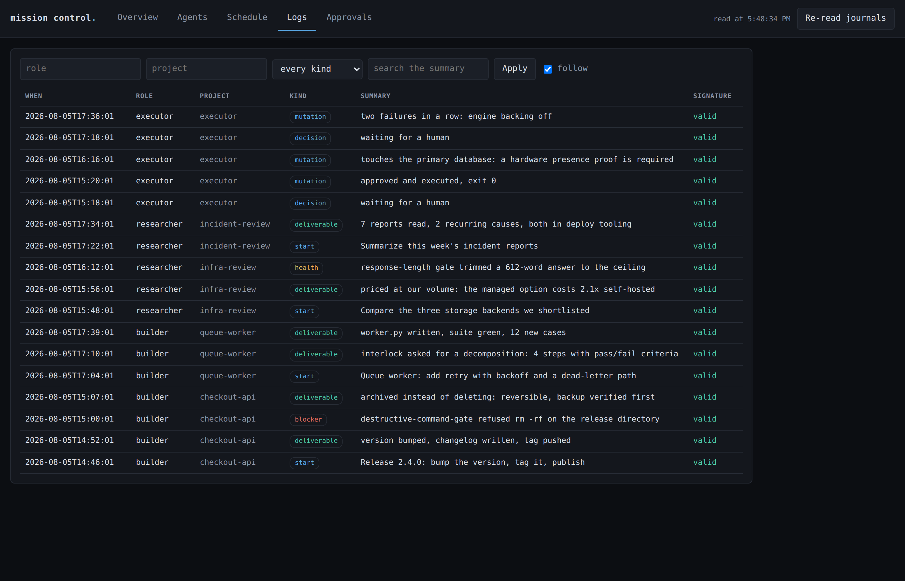
</p>

Every row is **signed**, and the panel recomputes the signature as it reads. A
row edited after the fact shows up as tampered rather than blending in, because
a log you cannot trust is worse than no log: it makes you confident.

<p align="center">
  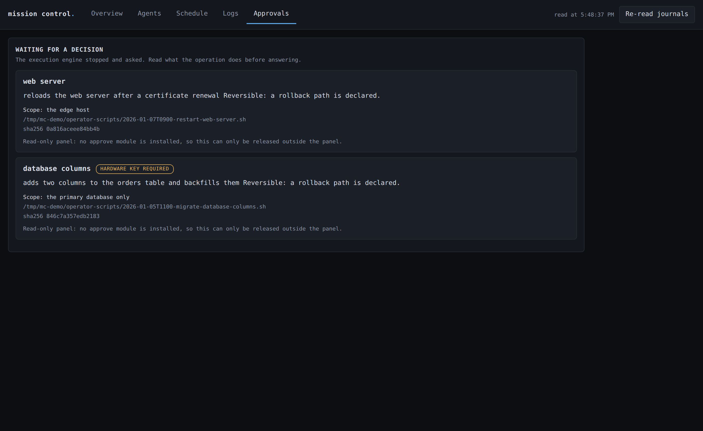
</p>

The approvals screen is the one that earns the panel. An operation waiting on
you is shown with **what it actually does in plain language**, its scope, its
reversibility and its hash, so the decision is made on the operation rather than
on its filename. Acting is a separate, optional module: a panel that can only
read is a panel you can leave running.

---

## Governor: which rules earn their place

A human cannot audit a system that makes decisions at machine speed. So a
proposed rule does not get added because it sounds sensible. It gets judged.

<p align="center">
  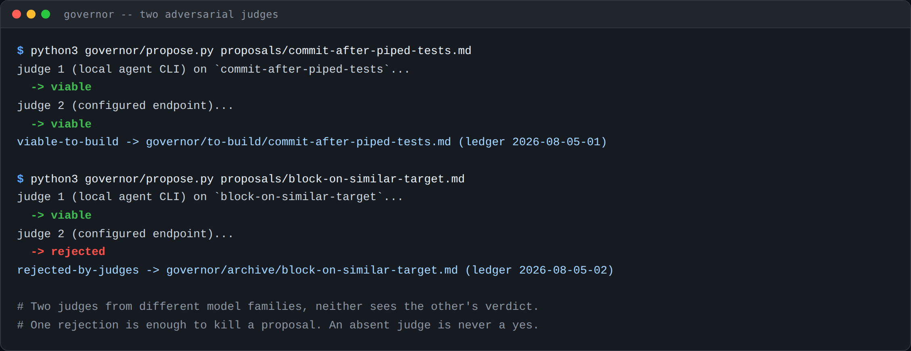
</p>

Two judges from **different model families**, neither seeing the other's
verdict. One rejection kills the proposal. A judge that cannot be reached
produces an explicit `judge-unavailable` and routes to a holding queue: it never
produces a yes by default, which is the entire point of having two.

<p align="center">
  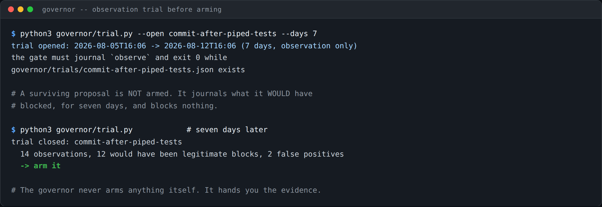
</p>

A surviving proposal is still **not armed**. It journals what it *would* have
blocked, for seven days, and blocks nothing. Then you look at the real catches
and decide. The governor never arms anything itself; it hands you the evidence.

<p align="center">
  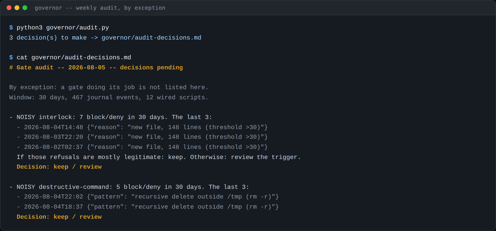
</p>

The weekly audit runs **by exception**: a gate doing its job is not listed. Only
the noisy ones, with real samples, and the silent ones, which are the dangerous
kind.

---

## Start here

```bash
git clone https://github.com/EmergentSpirit/agent-controls.git
cd agent-controls
python3 -m pytest tests/ -q         # 359 tests, no outbound network, no install
```

Then [**docs/quickstart.md**](docs/quickstart.md): fifteen minutes from clone to
a gate blocking something on purpose, with the real output at every step. Every
command on that page was executed to produce it.

| If you want to | Read |
|:--|:--|
| Understand how it holds together | [ARCHITECTURE.md](ARCHITECTURE.md) |
| Know what each gate blocks, and why | [docs/gates/](docs/gates/) |
| Enforce behavior, not just commands | [docs/shield.md](docs/shield.md) |
| Stop rebuilding what already exists | [docs/recall.md](docs/recall.md) |
| Prove the harness is alive | [docs/sentinel.md](docs/sentinel.md) |
| Govern which rules earn their place | [docs/governor.md](docs/governor.md) |
| Keep memory that does not lie | [docs/statutory-memory.md](docs/statutory-memory.md) |
| Observe without interfering | [docs/watch.md](docs/watch.md) |
| See the fleet right now | [docs/mission-control.md](docs/mission-control.md) |
| Wire it into your own launcher | [docs/launchers.md](docs/launchers.md) |
| Add a gate of your own | [CONTRIBUTING.md](CONTRIBUTING.md) |

### Why there is no install step

Standard library only. No package to add, no dependency to audit, no supply
chain to trust. Where an optional accelerator exists, there is a fallback and a
test proving the two agree. The suites open no outbound connection: every LLM
judge is replaced by a fixed verdict through an environment variable.

---

## One rule if you add your own

> **A gate is born from an incident, never from a good idea.**

If you cannot tell the story of the day it hurt, the rule is noise, and noise
costs false positives until someone switches the whole thing off.

That is what the governor is for, and most proposals die at the judges. That is
the mechanism working.

## License

Apache-2.0. See [LICENSE](LICENSE).
